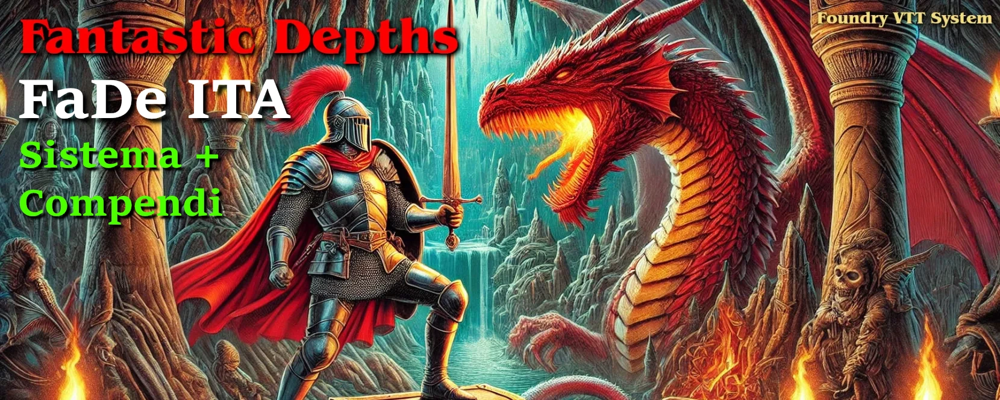

# FaDe ITA - Traduzione del Sistema e Compendi di Fantastic Depths per FoundryVTT

      

***  
**Sistema di Gioco**: Installa dall'archivio di Foundry o:
- :dragon: **Fantastic Depths** https://github.com/Forelius/fantastic-depths
- :floppy_disk: Installazione Manuale (Stabile): https://raw.githubusercontent.com/Forelius/fantastic-depths/refs/heads/stable/system.json
- :floppy_disk: *Installazione Manuale (Pre-Release)* se vuoi godere degli ultimi aggiornamenti ancora in fase di test: https://raw.githubusercontent.com/Forelius/fantastic-depths/refs/heads/main/system.json

**Moduli necessari**
- :books: **Fantastic Depths Compendiums** https://github.com/Forelius/fade-compendiums
- :books: **FaDe ITA** https://github.com/fvtt-italian-translations/fade-lang-it/releases
- :globe_with_meridians: **Babele** https://gitlab.com/riccisi/foundryvtt-babele  

***
Siamo sul server Discord di **20diGuerra**! https://discord.gg/Suxh2jnPst
   
*Fondatore e coordinatore progetto + traduzioni FaDe ITA*: **FR4NC35C0**  
*Realizzazione e gestione tecnica di GitHub e Weblate*: **N1xx1**  
*Collaboratori per la traduzione*: **Wingfireblade(Paolo)**  

> _Uno speciale ringraziamento a **Forelius** per aver fornito assistenza nella localizzazione dei testi per la traduzione del suo sistema di gioco e per la sua passione e dedizione nel creare e migliorare questo fantastico modulo per Foundry VTT, ispirato a Dark Dungeons, un retro-clone OGL dell'edizione Rules Cyclopedia di Dungeons & Dragons. Dark Dungeons è stato scritto da Blacky the Blackball, catturando l'essenza del D&D classico mentre modernizza e semplifica le regole per il gioco contemporaneo._

**WIKI**: https://github.com/Forelius/fantastic-depths/wiki

## Licenze

I contenuti di questo modulo sono sotto le seguenti licenze:

- [Limited License Agreement for module development 09/02/2020](https://foundryvtt.com/article/license/)

***

